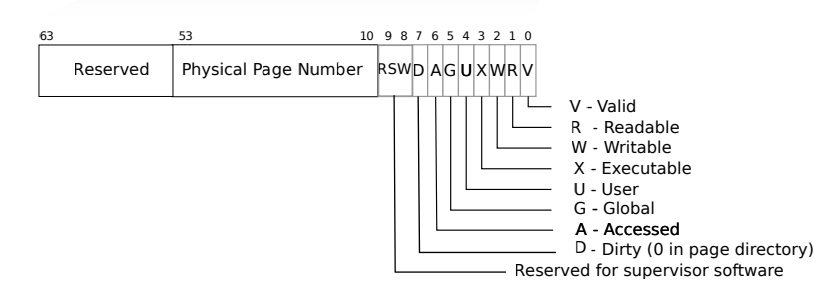
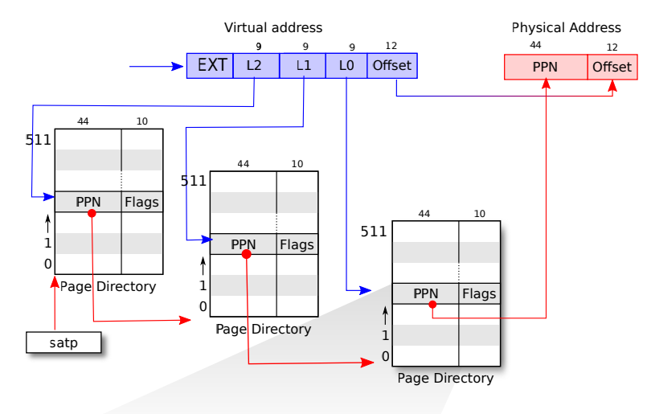
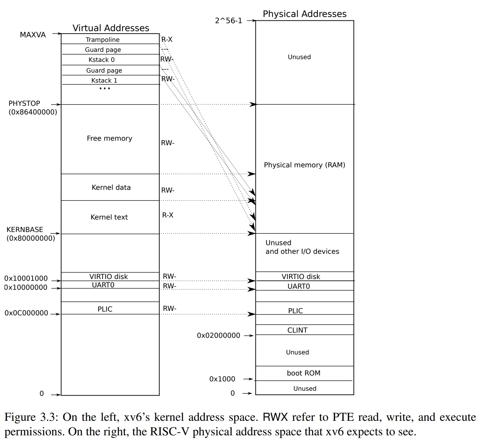
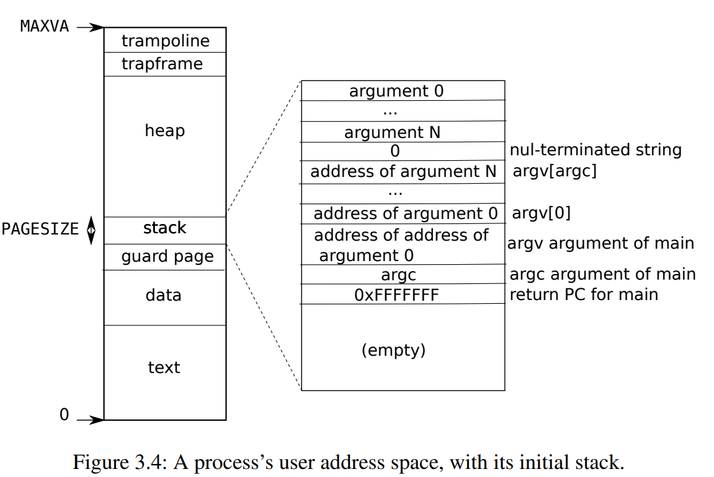

xv6 is a re-implementation of Dennis Ritchie's and Ken Thompson's Unix
Version 6 (v6).  xv6 loosely follows the structure and style of v6,
but is implemented for a modern RISC-V multiprocessor using ANSI C.

ACKNOWLEDGMENTS

xv6 is inspired by John Lions's Commentary on UNIX 6th Edition (Peer
to Peer Communications; ISBN: 1-57398-013-7; 1st edition (June 14,
2000)). See also https://pdos.csail.mit.edu/6.828/, which
provides pointers to on-line resources for v6.

The following people have made contributions: Russ Cox (context switching,
locking), Cliff Frey (MP), Xiao Yu (MP), Nickolai Zeldovich, and Austin
Clements.

We are also grateful for the bug reports and patches contributed by
Takahiro Aoyagi, Silas Boyd-Wickizer, Anton Burtsev, Ian Chen, Dan
Cross, Cody Cutler, Mike CAT, Tej Chajed, Asami Doi, eyalz800, Nelson
Elhage, Saar Ettinger, Alice Ferrazzi, Nathaniel Filardo, flespark,
Peter Froehlich, Yakir Goaron,Shivam Handa, Matt Harvey, Bryan Henry,
jaichenhengjie, Jim Huang, Mat煤拧 J贸kay, Alexander Kapshuk, Anders
Kaseorg, kehao95, Wolfgang Keller, Jungwoo Kim, Jonathan Kimmitt,
Eddie Kohler, Vadim Kolontsov , Austin Liew, l0stman, Pavan
Maddamsetti, Imbar Marinescu, Yandong Mao, , Matan Shabtay, Hitoshi
Mitake, Carmi Merimovich, Mark Morrissey, mtasm, Joel Nider,
OptimisticSide, Greg Price, Jude Rich, Ayan Shafqat, Eldar Sehayek,
Yongming Shen, Fumiya Shigemitsu, Cam Tenny, tyfkda, Warren Toomey,
Stephen Tu, Rafael Ubal, Amane Uehara, Pablo Ventura, Xi Wang, Keiichi
Watanabe, Nicolas Wolovick, wxdao, Grant Wu, Jindong Zhang, Icenowy
Zheng, ZhUyU1997, and Zou Chang Wei.

The code in the files that constitute xv6 is
Copyright 2006-2020 Frans Kaashoek, Robert Morris, and Russ Cox.

ERROR REPORTS

Please send errors and suggestions to Frans Kaashoek and Robert Morris
(kaashoek,rtm@mit.edu). The main purpose of xv6 is as a teaching
operating system for MIT's 6.S081, so we are more interested in
simplifications and clarifications than new features.

BUILDING AND RUNNING XV6

You will need a RISC-V "newlib" tool chain from
https://github.com/riscv/riscv-gnu-toolchain, and qemu compiled for
riscv64-softmmu. Once they are installed, and in your shell
search path, you can run "make qemu".

# 底下写记录

---

#### 8.29

我这进度属于是跟实际课表同步了....

回顾一下写个总笔记，从page table开始吧

page: 物理存储设备的单元，xv6中为4KB大小

page table: 存储虚拟内存映射到物理内存的表

xv6为Sv39，即使用了39位的虚拟内存，其中27位用来寻找page table entries (PTEs)，12位为Offset

PTE: page table entry，其中包含了44位的physical page
number (PPN),用来定位物理内存页，还有10位的flag作为控制信息

xv6的寻址采用了三级寻址方式，即将页表分为三级，每一级存储512条PTE。satp定位到第一级页表，9位的L2作为偏移寻找到一个PTE，其中的PPN寻找到第二级页表。循环寻找，第三级页表的PPN定位到所需要的物理页，再结合12位offset作为物理地址

此为xv6的内核内存结构，内核中部分地址为直接映射，加快内核速度

- RISC-V的trap机制

用于trap的寄存器：

stvec:存trap handler的地址

sepc: system exception process counter 用来存trap前的pc

scause: 识别trap的原因

sscratch: 可以暂存别的寄存器，为内核提供可用的寄存器

sstatus: 存一些控制信息，比如SIE位存是否能device interrupt

trap流程：

如果陷阱是设备中断，并且 sstatus 寄存器中的 SIE 位被清除，则不执行以下操作。
通过清除 sstatus 中的 SIE 位来禁用中断。
将程序计数器（pc）的值复制到 sepc。
将当前模式（user or supervisor）保存在 sstatus 寄存器中的 SPP 位中。
设置 scause 以反映陷阱的原因。
将模式设置为supervisor。
将 stvec 的值复制到程序计数器（pc）。
从新的程序计数器位置开始执行。

user space的trap:

先跳转至trampoline page中的uservec,保存所有用户寄存器；再进入usertrap中，根据不同trap类型执行不同操作；返回时先调用usertrapret，设置某些信息，如将stvec设置为uservec，以避免之前设置为了kernelvec，更改sepc，向userret传递参数等；最后调用userret，复位用户寄存器并返回。

由于trampoline page在每一个进程中都映射在了相同的虚拟地址，所以当在trampoline page中切换page table时能不影响trap handler的运行

kernel space的trap:

在usertrap中从user space进入kernel space时，stvec会被设置为kernelvec的地址。

kernel trap流程跟user trap差不多，不过kernel trap要么是kernel出问题了，那就比较严重，直接拜拜；要么就是计时器到了，需要切换线程。

- Page Fault

当用户访问了非法的内存地址时，即会发生page fault，如访问不存在的地址或flag的控制符不允许对应的操作。有几种利用page fault可做出的特性，能提升系统速度。

1. Copy On Write(COW)
    先都指向同一块，要写了再分开

2. lazy allocation
    先不分配，要用了再分配

3. demand paging
    先不加载，要用了再加载

4. paging to disk
    把磁盘当内存

#### 8.16

今天看课，写点笔记

kernal = trusted computing base (TCB)

#### 8.15

总算是把lab1写完了

这么久没学别的公开课，发现英语又有点小吃力了，文档有时理解不全意思，导致lab做不太顺

lab1还是一些比较基础的实验，主要是熟悉用的

几个bug:

- file descriptor同时开启的数量有上限，使用完记得关

- find的make grade不会检查你是否写了查询具体文件的代码，但是后面的xargs要用，没写的话就有bug

- 大部分实验都可以偷懒，不过感觉还是不太好，我就尽量照着他说的来
